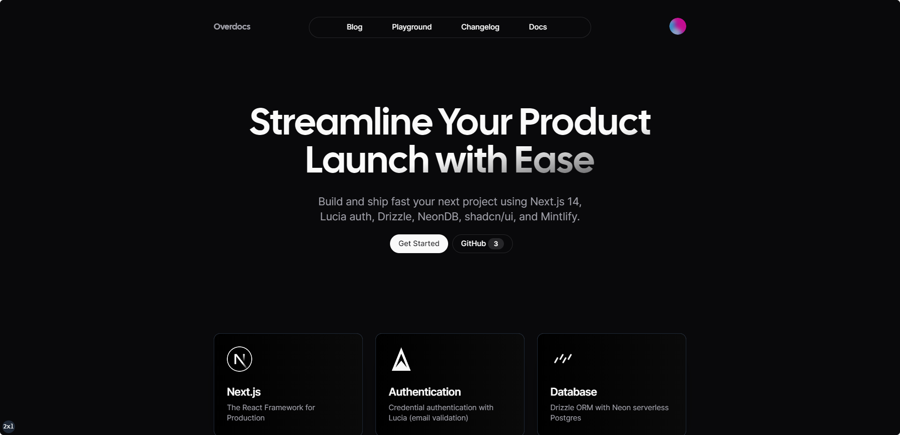

<a href="https://overdocs.vercel.app">
  
  <h1 align="center">Overdocs SaaS Starter</h1>
</a>

<p align="center">
  <a href="#introduction"><strong>Introduction</strong></a> ·
  <a href="#installation"><strong>Installation</strong></a> ·
  <a href="#tech-stack--features"><strong>Tech Stack + Features</strong></a> ·
  <a href="#credits"><strong>Credits</strong></a>
</p>
<br/>

## Introduction

 OverDocs harnesses a powerful stack including Next.js 14, Drizzle, Neon, Lucia Auth, Resend, React Email, Shadcn/ui, and Stripe. These seamlessly integrated technologies accelerate your development and Saas journey.

 ## Motivation

 Implementing authentication in Next.js, especially Email+Password authentication, can be challenging. NextAuth intentionally limits email password functionality to discourage the use of passwords due to security risks and added complexity. However, in certain projects, clients may require user password authentication. Lucia offers a flexible alternative to NextAuth.js, providing more customization options without compromising on security. This template serves as a starting point for building a Next.js app with Lucia authentication.

## Installation

Clone this repo locally with the following command:

```bash
pnpx create-next-app my-saas-project --example "https://github.com/cahyawibawa/overdocs.git"
```

1. Install dependencies using pnpm:

```sh
pnpm install
```

2. Copy `.env.example` to `.env.local` and update the variables.

```sh
cp .env.example .env.local
```

3. Start the development server:

```sh
pnpm run dev
```

> [!NOTE]  
> I use [npm-check-updates](https://www.npmjs.com/package/npm-check-updates) package for update this project.
>
> Use this command for update your project: `ncu -i --format group`

## Roadmap

- [x] Setup the Database with Drizzle and Neon Serverless
- [x] Add Email & Password Credentials Authentication with Lucia, React Hook Form & Zod
- [x] Email Verification with Nodemailer
- [ ] Add Pricing Section
- [ ] Update documentation for installation & configuration (work on it)
- [ ] Update Password
- [ ] Fix Oauth Google and Github credentials
- [ ] Add Resend Integrations
- [ ] Add Stripe or Lemonsqueezy for subscription


## Tech Stack 

- [Next.js](https://nextjs.org/) – React framework for building performant apps with the best developer experience
- [Lucia](https://lucia-auth.com/) – Handle user authentication with ease with providers like Google, GitHub, etc.
- [Drizzle ORM](https://orm.drizzle.team/) – Typescript-first ORM for Node.js
- [Neon](https://neon.tech/) – Serverless Postgres with autoscaling, branching, bottomless storage and generous free tier.
- [React Email](https://react.email/) – Versatile email framework for efficient and flexible email development
- [Resend](https://resend.com/) – A powerful email framework for streamlined email development
- [Tailwind CSS](https://tailwindcss.com/) – Utility-first CSS framework for rapid UI development
- [Shadcn/ui](https://ui.shadcn.com/) – Re-usable components built using Radix UI and Tailwind CSS
- [MinifyJS](https://minify.com/) – Modern standard for public facing documentation
- [Vercel](https://vercel.com/) – Easily preview & deploy changes with git
- [Stripe](https://stripe.com/) – For subscriptions 


### Code Quality

- [TypeScript](https://www.typescriptlang.org/) – Static type checker for end-to-end typesafety
- [Prettier](https://prettier.io/) – Opinionated code formatter for consistent code style
- [ESLint](https://eslint.org/) – Pluggable linter for Next.js and TypeScript

### Miscellaneous

- [Vercel Analytics](https://vercel.com/analytics) – Track unique visitors, pageviews, and more in a privacy-friendly way

## Credits

This project was inspired by Miickasmt [Next SaaS Stripe Starter](https://github.com/mickasmt/next-saas-stripe-starter) and 
SaaSy Kits [Next.js Lucia Auth Starter Template](https://github.com/saasykits/next-lucia-auth).


